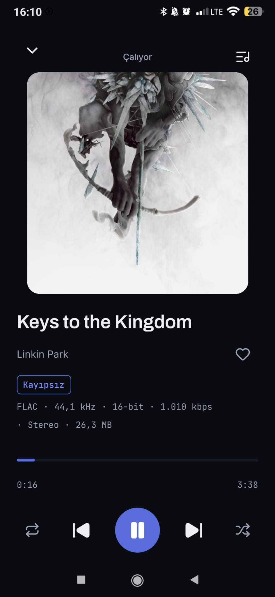
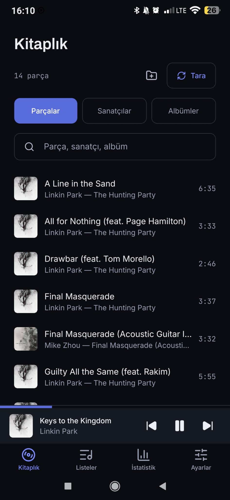
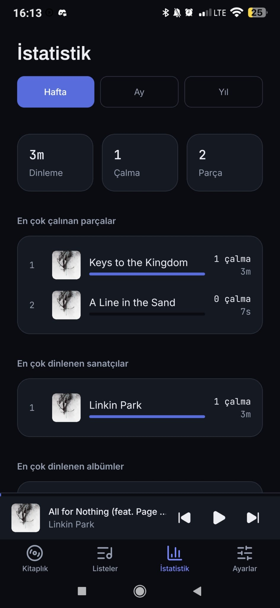
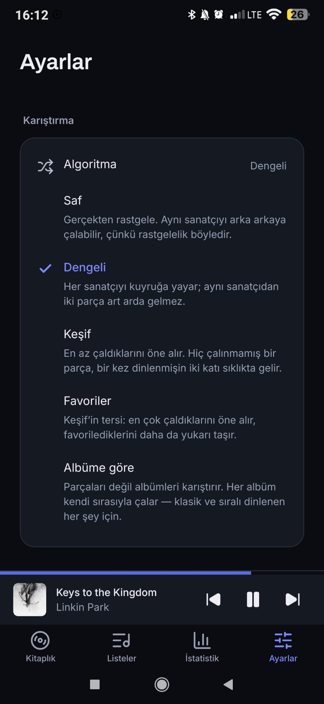

# Mufify

An offline-only music player for Android. React Native, Expo SDK 57, TypeScript.

It plays the files a streaming service will not: FLAC, ALAC, and anything else
already on the phone. It surfaces the technical truth of a file rather than
hiding it. And it does not have a network layer — not a disabled one, not one
behind a setting. Release builds ship without the `INTERNET` permission at all.

## Download

[**Latest release**](https://github.com/Yefee8/mufify/releases/latest) — an APK
you can sideload. It ships without the `INTERNET` permission; the release notes
say how to check that yourself, and what the build is signed with.

## Screenshots

<p>
  
  
  
  
</p>

More, with what each one is showing, in [docs/screenshots.md](docs/screenshots.md).

## What it does

- **Playback** of local files, lossless first-class, with background playback,
  lock-screen controls and a persistent queue. No crossfade —
  [ADR 023](docs/adr/023-no-crossfade.md) says why, and what one would cost.
- **Five shuffle algorithms**, chosen in Settings, each explained where you
  choose it. Not one shuffle behind a toggle — see [docs/shuffle.md](docs/shuffle.md).
- **Local playlists** with drag-reorder, a cover mosaic or a picture you chose
  and framed yourself, and shuffle. Playlists and tracks can be liked, and either list filtered to
  what is.
- **A ten-band equaliser** where the platform allows it, with presets you can
  save and pass on as a line of text — [ADR 022](docs/adr/022-ten-bands-and-presets-you-can-post.md).
- **Deleting tracks and albums**, through the system's own confirmation, with a
  multi-select mode for doing several at once —
  [ADR 021](docs/adr/021-deleting-files-needs-the-system-to-ask.md).
- **Listening statistics** computed on the device from your own history: top
  tracks, artists, albums and playlists by week, month and year, with a Wrapped
  summary. Nothing is uploaded because there is nowhere to upload it to.
- **Technical metadata surfaced**: bitrate, sample rate, bit depth, codec, file
  size, on a monospaced spec strip.
- **Dark and light themes, Turkish and English**, both switchable.

## The promise

No network. No accounts. No telemetry. No analytics SDK.

This is enforced rather than intended: `plugins/withOfflineOnly.js` strips the
`INTERNET` permission from the release manifest and restores it only for debug
builds, where Metro needs it. A change that introduces a network call does not
fail review — it fails to work.

## Requirements

- **Node 22+**
- **JDK 17 or 21** — Android Studio's bundled JBR is fine, no separate install
- **Android Studio** with **SDK Platform 36+**
- macOS or Linux

`minSdkVersion` is 26. Raising it to 31 was considered and rejected: it costs
roughly a fifth of Android devices while deleting almost no code. See
[ADR 002](docs/adr/002-min-sdk-26.md).

## Setup

None of this is set by default, and every "it works on my machine" failure in
this project so far has been one of these three lines missing. Put them in
`~/.zshrc`:

```bash
export JAVA_HOME="/Applications/Android Studio.app/Contents/jbr/Contents/Home"
export ANDROID_HOME="$HOME/Library/Android/sdk"
export PATH="$JAVA_HOME/bin:$ANDROID_HOME/platform-tools:$ANDROID_HOME/emulator:$PATH"
```

Verify before blaming the code:

```bash
java -version        # 17 or 21
adb devices          # your device, "device" not "unauthorized" or "offline"
npx expo-doctor
```

Then:

```bash
npm install
./app.sh             # checks the environment, finds a device, starts the dev build
```

`app.sh` (and `app.bat` on Windows) only *checks* the environment — it will tell
you exactly what is missing and stop. It will not set `JAVA_HOME` or
`ANDROID_HOME` for you, because silently changing a developer's toolchain
environment is a worse failure than an error message.

## Running

```bash
npx expo start --dev-client   # the normal one. JS/TS changes hot reload.
npm run lint
npm run typecheck
npm test
npm run db:generate           # after a schema change
```

`npx expo run:android` is **only** for native changes: adding or removing a
native dependency, editing `app.json`, or changing a config plugin. It is a
ten-minute build, and reaching for it after a TypeScript edit is the most common
way to waste an afternoon here.

Kotlin has its own tests:

```bash
cd android && ./gradlew :audio-tags:testDebugUnitTest
```

### Installing on a device

`adb install -r` works on the emulator and, in practice, on MIUI too — including
updating in place over an existing build without losing its data. If it does
fail with `INSTALL_FAILED_USER_RESTRICTED`, which MIUI does depending on how the
device is configured, push the file and install it from the phone instead:

```bash
adb push android/app/build/outputs/apk/debug/app-debug.apk /sdcard/Download/
```

MIUI does reliably block `adb shell input` and `pm grant` with a
`SecurityException`, so **automated UI testing on those devices is not
possible** — taps need a human. Use the emulator for behaviour and keep the
phone for what only it can answer: old-API paths, real frame timing, the media
notification, and anything involving headphones or a phone call.

It blocks input, not the build, and that is enough for a rendering bug the
emulator will not reproduce. Put the app into the state you need from code — a
`setTimeout` in `PlayerLayer` that opens the sheet on launch — and add
`android:showWhenLocked="true" android:turnScreenOn="true"` to `.MainActivity`
in the generated manifest, so `am start` wakes a sleeping screen. Then
`exec-out screencap` for what it drew and `dumpsys activity top` for the native
view tree with bounds. Both patches are throwaway, and an incremental
`assembleRelease` is about 35 seconds, so it is fast enough to bisect with.

## Building a release

```bash
cd android
./gradlew assembleRelease   # app/build/outputs/apk/release/app-release.apk
./gradlew bundleRelease     # app/build/outputs/bundle/release/app-release.aab
```

The APK is universal — every ABI in one file, which is why it is around 130 MB.
That is the one to sideload or hand to somebody. The **AAB is the one to
upload**: Play splits it per device and what people download is a fraction of
that.

Signing is passed in on the command line rather than written into the
repository, so no key or password ever lands in a tracked file:

```bash
./gradlew bundleRelease assembleRelease \
  -Pandroid.injected.signing.store.file="$HOME/path/to/key.jks" \
  -Pandroid.injected.signing.store.password=… \
  -Pandroid.injected.signing.key.alias=… \
  -Pandroid.injected.signing.key.password=…
```

A build signed with the upload key **cannot be installed over an earlier
debug-signed one**. Uninstall first.

Publishing one:

```bash
gh release create v1.4.2 \
  android/app/build/outputs/apk/release/app-release.apk#mufify-1.4.2.apk \
  --title "Mufify 1.4.2" --notes-file <notes>
```

Raise `android.versionCode` in `app.json` first, and raise it **whatever the
version name does**. Android refuses an install whose `versionCode` does not
climb, and the two are independent — 1.3.1 followed 1.4.0 on code 11, which is
the only reason it installs over it.

The artifacts are gitignored along with the rest of `android/` — a 128 MB binary
does not belong in the history. The release is where it goes.

What the release build is checked for, and what `assembleRelease` produced on
2026-08-19:

| Check | Result |
|---|---|
| `INTERNET` permission | **absent** — this is the whole promise, and `plugins/withOfflineOnly.js` is what keeps it out |
| `RECORD_AUDIO`, `SYSTEM_ALERT_WINDOW`, `WRITE_EXTERNAL_STORAGE` | absent, blocked in `app.json` |
| Debuggable | no |
| `versionCode` / `versionName` | 12 / 1.4.2 |

One permission does survive that is worth knowing about: `ACCESS_NETWORK_STATE`,
pulled in by a dependency rather than asked for here. It cannot open a
connection — that needs `INTERNET`, which is absent — but a Play Store listing
renders it as "view network connections", which reads oddly next to the claim on
this page. It is deliberately **not** blocked yet: removing a permission a
library expects is the kind of change that fails at runtime on a device rather
than at build time, and it has not been tested on hardware.

## Architecture

```
app/          routes only — read params, render a screen, nothing else
src/
  components/ui/   shared presentational components
  features/        one directory per feature: screens, components, hooks
  services/        pure logic — shuffle, stats, scanner, formatters
  db/              schema, migrations, and the only place Drizzle is imported
  theme/           design tokens, in exactly two files
  i18n/            en.json and tr.json, kept in step by a test
modules/      local native modules (Kotlin)
```

Four rules that are bugs rather than preferences when violated:

1. Only `src/services/audio/*` imports the audio library.
2. Only `src/db/queries/*` imports Drizzle or expo-sqlite.
3. No business logic in component bodies.
4. Layers point downward: `components → hooks → services → db`.

[docs/architecture.md](docs/architecture.md) goes further: the startup ordering,
the two flows worth tracing, and why there is no global state library.

## Documentation

| | |
|---|---|
| [AGENTS.md](AGENTS.md) | the house style, binding on humans and agents alike |
| [docs/screenshots.md](docs/screenshots.md) | what it looks like, with what each screen is doing |
| [docs/architecture.md](docs/architecture.md) | how the pieces fit, and where state lives |
| [docs/components.md](docs/components.md) | what each shared component is for |
| [docs/theming.md](docs/theming.md) | the token system, and how to add a colour |
| [docs/i18n.md](docs/i18n.md) | how to add a string and a language |
| [docs/database.md](docs/database.md) | schema, indexes, the play-counting rule |
| [docs/scanner.md](docs/scanner.md) | the two-stage scan and artwork cache |
| [docs/player.md](docs/player.md) | the audio engine and its Android gotchas |
| [docs/shuffle.md](docs/shuffle.md) | each algorithm in plain language |
| [docs/stats.md](docs/stats.md) | events, rollups, period keys, repeat detection |
| [docs/performance.md](docs/performance.md) | measurements, before and after |
| [docs/adr/](docs/adr/) | every non-obvious decision, with its reasoning |

## Contributing

See [CONTRIBUTING.md](CONTRIBUTING.md). The short version: read `AGENTS.md`
first, and `lint`, `typecheck` and `test` must all pass before a commit counts
as done.

## Licence

MIT. See [LICENSE](LICENSE).
