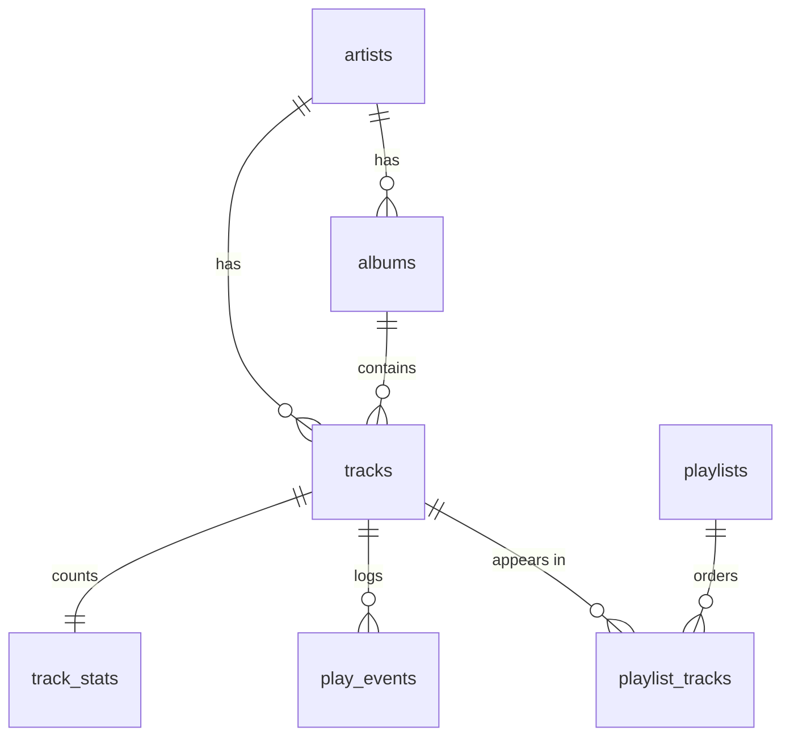

# Database

SQLite via `expo-sqlite`, typed with Drizzle. Everything that must survive a
restart *as data* lives here; settings live in MMKV instead.

---

## Boundary

**Only `src/db/**` may import Drizzle or `expo-sqlite`.** Components and hooks
call typed query functions from `src/db/queries/`. This is enforced by ESLint
(`no-restricted-imports`), not by discipline — it caught a violation on the
day it was written.

```
src/db/
  client.ts        # connection + pragmas. The single SQLiteDatabase.
  schema.ts        # Drizzle schema. The source of truth for migrations.
  migrations/      # drizzle-kit output, committed
  seed.ts          # fake library for UI work, development only
  useDatabase.ts   # runs migrations, gates first paint
  queries/         # one file per domain — the public surface
```

---

## Schema



Nine tables: `artists`, `albums`, `tracks`, `track_stats`, `playlists`,
`playlist_tracks`, `play_events`, `stats_rollups`, `scan_folders`.

### Two rules the schema exists to enforce

**No blobs.** Artwork is extracted once during a scan, resized, written to the
cache directory, and referenced by path. `artwork_path` is a string. A 24-bit
FLAC picture block can be several megabytes; putting that in SQLite would make
every query that touches the row slow and the database enormous.

**Rows are never deleted during a rescan.** A file that has gone gets
`is_missing = 1`. Deleting it would take playlist entries and play history with
it, and an SD card that is merely unmounted would look like a library wipe.

### Spec strip columns

`container`, `codec`, `bitrate_kbps`, `sample_rate_hz`, `bit_depth`,
`channels` are all nullable, deliberately. `MediaMetadataRetriever` returns
null for sample rate and bit depth below API 31, and for any file whose
extractor does not populate them at any API level. `SpecStrip` renders the
fields it has. See `docs/adr/002-min-sdk-26.md`.

FLAC is variable bitrate; the stored value is the computed average, which is
the honest number to display.

### Indexes

Beyond the primary keys: `tracks(artist_id)`, `tracks(album_id)`,
`tracks(genre)`, `tracks(is_missing)`, `tracks(title COLLATE NOCASE)` for the
alphabetical list and search, `tracks(file_uri)` unique — the stable identity a
rescan matches on. `play_events` is indexed on `started_at_utc`, `track_id`,
`week_key` and `month_key`. `stats_rollups` has the unique index that the
incremental upsert targets.

### Pragmas

Set once per connection in `client.ts`:

| Pragma | Why |
|---|---|
| `journal_mode = WAL` | Readers do not block the writer, so the library list stays scrollable during a scan |
| `synchronous = NORMAL` | Safe under WAL, far fewer fsyncs during batched inserts |
| `foreign_keys = ON` | **Off by default in SQLite.** Without it every cascade in the schema is decoration |
| `temp_store = MEMORY` | Sorts and temporary indexes stay off disk |

---

## The play-counting rule

Implemented in `src/services/stats/playCounting.ts`, pure and unit tested. The
recorder and the stats screens both go through it, so they cannot disagree.

- A **play** needs `ms_played >= min(30_000, duration_ms * 0.5)` — thirty
  seconds, or half the track when the track is shorter than a minute.
- A **skip** is `ms_played < duration_ms * 0.2` — abandoning it in the first
  fifth.
- Anything else is **partial**: it happened, but it counts as neither.
- Seeking backwards does not create a second event. That is a recorder concern
  and lands with playback in Phase 3.

### The thresholds overlap — this is unresolved

For any track longer than **2.5 minutes**, `duration * 0.2` is past the
30-second play mark. A 4-minute track listened to for 40 seconds is over the
30s play threshold *and* under the 48s skip threshold. It satisfies both rules.

Most songs are longer than 2.5 minutes, so this is the common case, not an
edge case.

**Current behaviour: play wins.** The positive test runs first, so the overlap
counts as a play and not a skip. That keeps play counts honest and
under-reports skips. `hasAmbiguousThresholds(durationMs)` reports whether a
given duration is in the overlapping regime, and the tests pin the behaviour so
that changing it is a visible diff.

The alternative reading — a skip means "did not finish", so the skip test
should win — is defensible and would change every rollup. **This needs a
decision before Phase 7.** Changing it afterwards means rebuilding all history.

---

## Period keys

`week_key`, `month_key` and `year_key` are written **at insert time, in the
user's local timezone**, and never derived at read time. Deriving them later
gives wrong answers across DST and travel, and forces a table scan.

Implemented in `src/services/stats/periodKeys.ts`, pure and unit tested.

### DST

The keys come from the local *calendar day* only — year, month, day — which is
then carried as a UTC midnight for all subsequent arithmetic. UTC has no days
that gain or lose an hour, so a DST boundary cannot move a key. This is tested
across both the spring and autumn European transitions.

### Week numbering

`2026-W31`. With the Monday setting this is exactly ISO 8601: the fourth day of
the week decides which year owns it, so a week straddling New Year belongs to
whichever year holds most of it. Consequences, all tested:

- 31 December 2025 is `2026-W01`
- 1 January 2027 is `2026-W53`
- the week key and the month key can disagree about the year, legitimately

The Sunday setting applies the same majority rule shifted by a day. The two
settings can put the same instant in different years — 3 January 2026 is
`2026-W01` under Monday and `2025-W53` under Sunday.

**Changing the week-start setting invalidates every week rollup** and has to
trigger a rebuild, not a renumber.

---

## Migrations

```bash
npm run db:generate   # after any change to schema.ts
```

`drizzle-kit` writes SQL plus a journal into `src/db/migrations/`, and **the
output is committed**. Migrations are not derived at runtime, so a build always
knows exactly which schema it expects.

`useDatabase()` runs pending migrations at startup and the root layout holds
the splash until it resolves — no screen can query a schema that does not exist
yet. If a migration fails, the app renders nothing rather than a broken tree;
surfacing that properly is an error-state task for Phase 8.

Never hand-edit a generated migration. Change `schema.ts` and generate a new
one.

---

## Seed data

`src/db/seed.ts` inserts a small fake library so UI work can proceed before the
scanner exists. Development only.

It is deliberately awkward in the ways a real library is: lossless and lossy
side by side, one 24/96 record, long Turkish titles that stress the layout, and
one missing file per album so the `is_missing` path is always exercised rather
than theoretical.

`seedDatabase()` no-ops when the library is already populated, so it is safe to
call on every launch.
