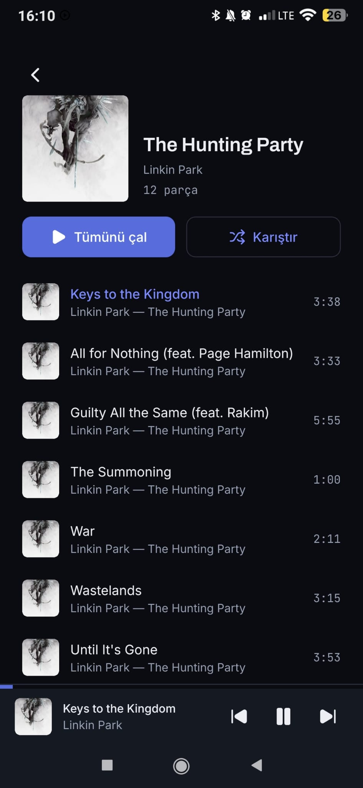
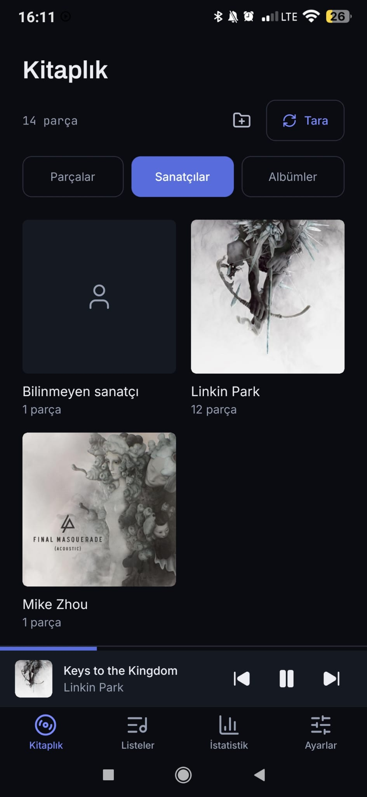
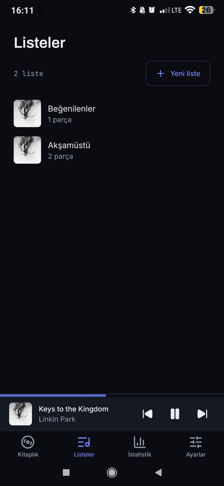
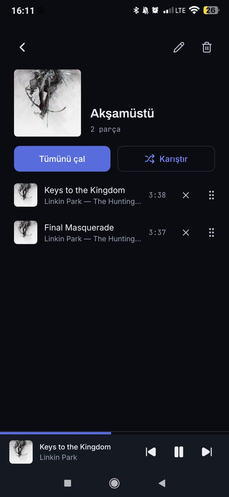
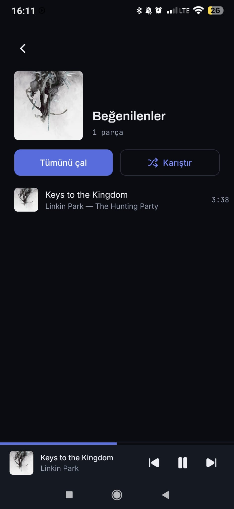
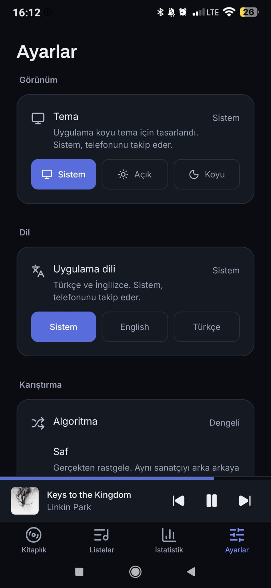
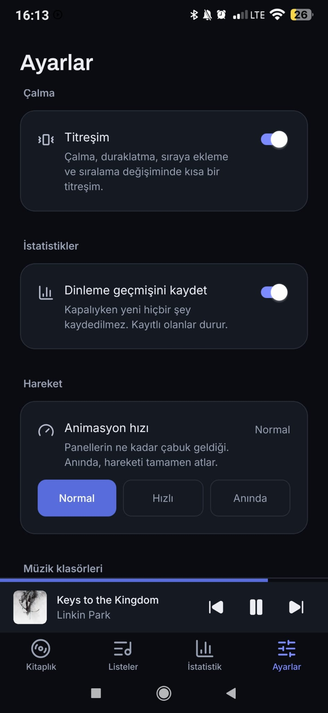
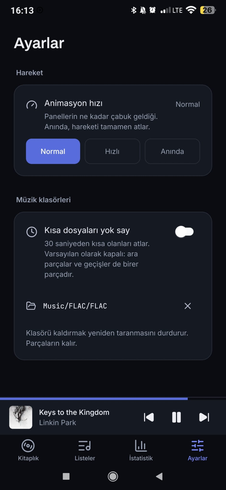

# Screenshots

Taken on a Xiaomi Mi 9T (Android 10, MIUI), dark theme, Turkish, against a real
FLAC library rather than the synthetic one used for performance work.

> The files live in [`docs/screenshots/`](screenshots/). If an image below is
> missing, see the note in that directory — the names are fixed so this page
> keeps working when they are replaced.

## Playing

| Now Playing | Album |
|---|---|
|  |  |

The spec strip under the title is the point of the app: `FLAC · 44,1 kHz ·
16-bit · 1.010 kbps · Stereo · 26,3 MB`, and a **Kayıpsız** badge that only
appears when the format is actually lossless. The transport strip at the bottom
stays put on every screen.

## Library

| Tracks | Artists |
|---|---|
|  |  |

Artists and albums are shelves over the same table rather than separate scans.
A file with no artist tag gets an **Bilinmeyen sanatçı** card rather than being
dropped — see [ADR 013](adr/013-unknown-metadata.md).

## Playlists

| Playlists | A playlist | Liked songs |
|---|---|---|
|  |  |  |

Liked songs is a virtual playlist over `track_stats.is_favorite`, and the count
on the card comes from the same query that fills the screen behind it — that
was not always true, and it is the sort of thing that goes wrong quietly.

## Statistics

| This week | Lists |
|---|---|
|  |  |

Everything is read from `stats_rollups`, never aggregated from the event log at
render time. A track heard for seven seconds shows as **0 çalma · 7s** — it
counted as listening time without counting as a play, which is the whole reason
there are three outcomes and not two ([ADR 005](adr/005-play-skip-partial.md)).

## Settings

| Appearance and language | Shuffle | Statistics and motion | Folders |
|---|---|---|---|
|  |  |  |  |

Every row says what it does. Five shuffle algorithms named without explanation
would be five names nobody can choose between — nobody knows what "Keşif" means
from the word.
